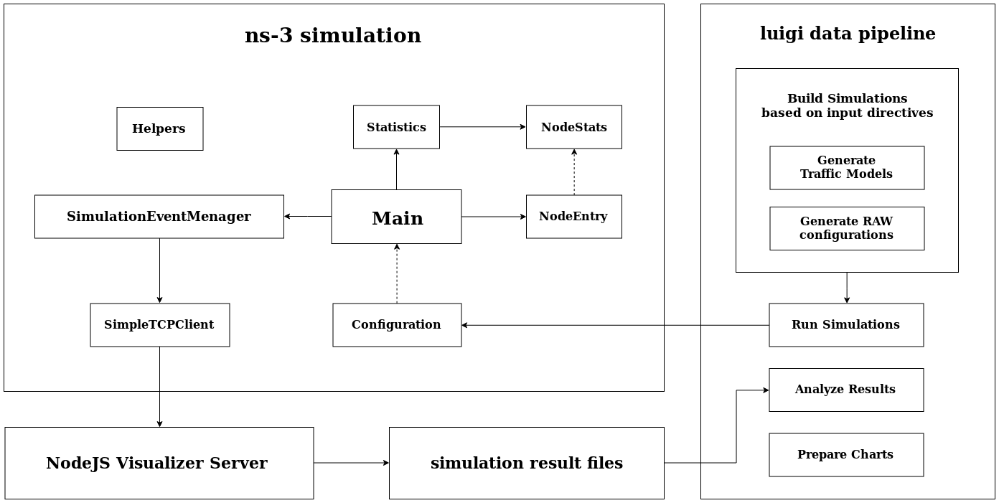

## Improving the Performance of Densely Deployed IEEE 802.11ah Networks
---
### Project Setup :
+ Clone 802.11ah ns-3 module: 
  + [IEEE-802.11ah-ns-3](https://github.com/imec-idlab/IEEE-802.11ah-ns-3)
+ Configure it and build with *waf* acording to instructions 
+ Apply changes as described in:  pipelines/utils/simulationFileChanges.txt
+ Clone ahVisualizer module and run visualization page according to instructions:
  + [ahVisualizer](https://github.com/imec-idlab/ahVisualizer)
+ Install project requirements (python 3.6.8 required):
  ```console
  pip3 install -r requirements.txt
  ```

### Run Example Pipeline :
+ Delete *examplePipelineResults* directory
+ Set your paths in pipelines/examplePipeline.py :
  ```python
  outputResultsDir = '/your_path/magister_ludi/examplePipelineResults/'
  dirWithNS3_ahClone = '/your_ns3_ah_installation/IEEE-802.11ah-ns-3/'
  scriptsDir = '/your_path/magister_ludi/analysisScripts'
  ```
+ ... and run example pipeline !
  ```console
  /magister_ludi/pipelines$ time PYTHONPATH='.' luigi --module examplePipeline Final --local-scheduler
  ```
+ you can see example result charts in *examplePipelineResults/example_slots_saturation_plots*

---

### How this project interacts with ns-3:



---

### Useful links:

+ [Luigi website](https://luigi.readthedocs.io/en/stable/index.html)
+ [Sci-Luigi Mod](https://github.com/pharmbio/sciluigi)
+ [Surrogate Modelling Optimization](https://github.com/letiangit/SUMO_optimization)

### ns-3 802.11 ah research papers : 

+ ["Implementation and Validation of an IEEE 802.11ah Module for ns-3"](https://www.researchgate.net/publication/301328811_Implementation_and_validation_of_an_IEEE_80211ah_module_for_NS-3)
+ ["Extension of the IEEE 802.11ah ns-3 Simulation Module"](https://www.researchgate.net/publication/324910418_Extension_of_the_IEEE_80211ah_ns-3_Simulation_Module)
+ ["Real-Time Station Grouping under Dynamic Traffic for IEEE 802.11ah"](https://www.researchgate.net/publication/318014653_Real-Time_Station_Grouping_under_Dynamic_Traffic_for_IEEE_80211ah)
+ ["IEEE 802.11ah Restricted Access Window Surrogate Model for Real-Time Station Grouping"](https://www.researchgate.net/publication/324910349_IEEE_80211ah_Restricted_Access_Window_Surrogate_Model_for_Real-Time_Station_Grouping)
+ ["Performance Evaluation of IEEE 802.11ah NetworksWith High-Throughput Bidirectional Traffic"](https://www.researchgate.net/publication/322667771_Performance_Evaluation_of_IEEE_80211ah_Networks_With_High-Throughput_Bidirectional_Traffic)
